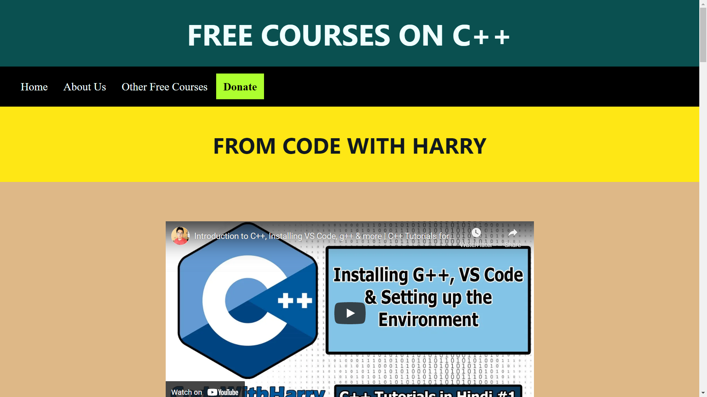
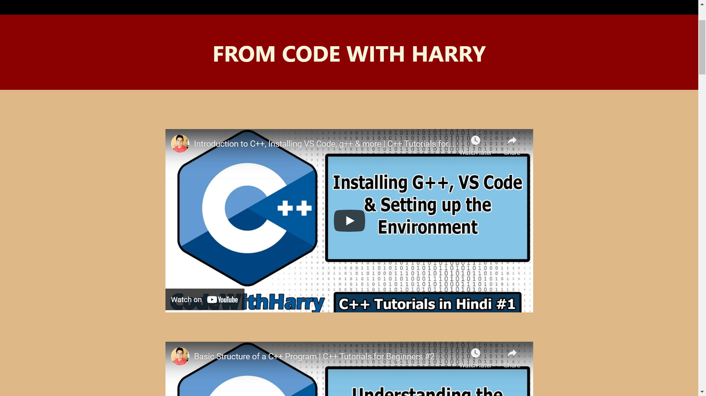
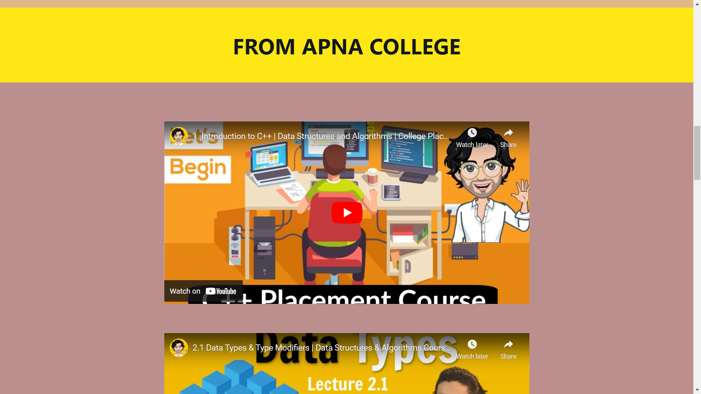
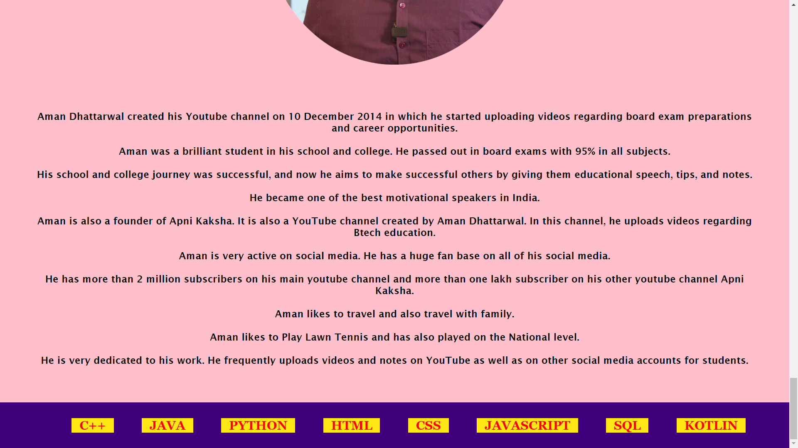

# Courses 

### A simple website for practicing css.

## WEBSITE URL- [COURSES](https://rishav-jha-mech.github.io/vintage-web-dev/4/courses/)

## PICTURES:

### i started to work on this project to learn css, i learnt about class, id, margin, padding, hover.