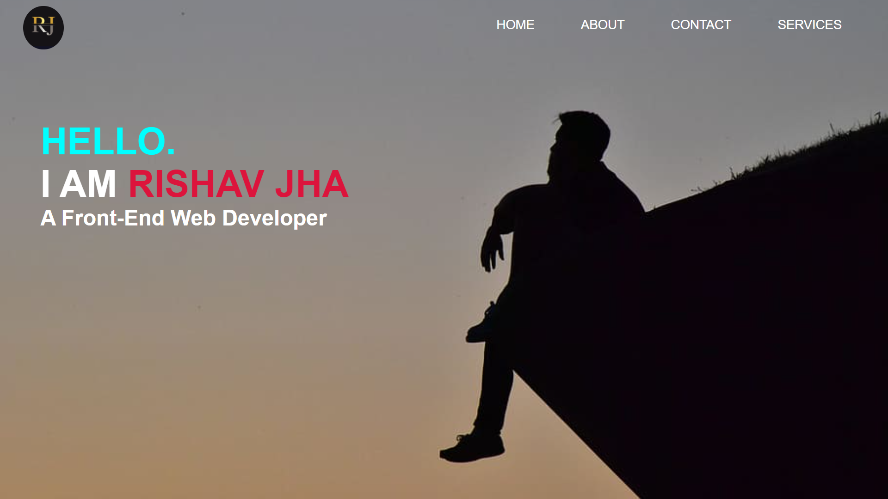
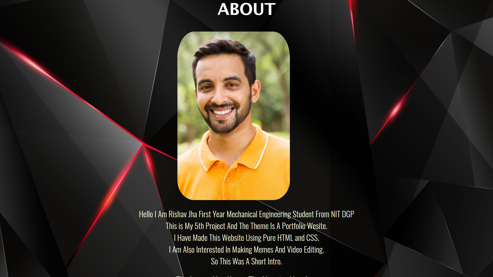

# Rishav Jha - Personal Portfolio website

## WEBSITE URL - [Rishav Jha](https://rishav-jha-mech.github.io/vintage-web-dev/5/PORTFOLIO/)

 

## Made this website for PRAKRITI AUDITIONS 2021

 

## Pictures -

## What I Learnt From This -

##### How to add background images via css, the div concept,the most stunning effect of hover function where i can display icons and in this project i wrote 400+ lines of CSS which was definitely a big deal for me at that time, i must say that i have written CSS in this project like a noob, but yeah it was my 2nd project using CSS so it is okay (KOL). I didnt know about Font AAwesome and how to use it so i downloaded the picture logo and used them in my project.

## VERDICT - Selected ! 
