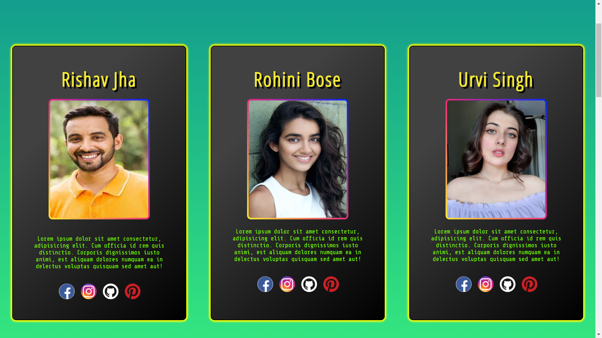
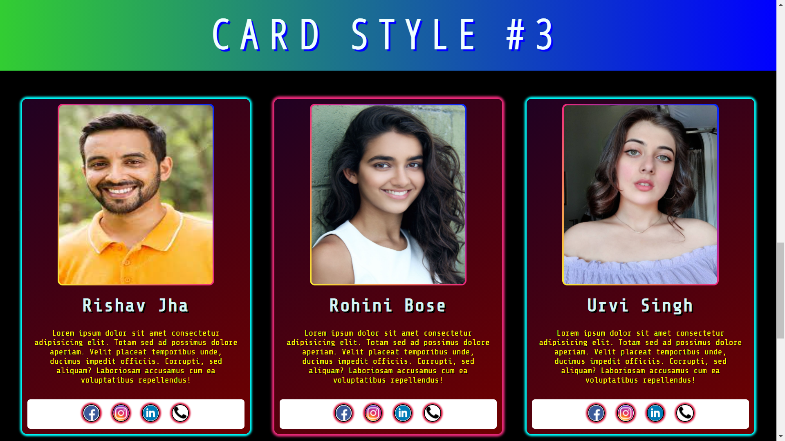

# CARD MASTERY - A Practice Project

## WEBSITE URL - [FLOXY](https://rishav-jha-mech.github.io/vintage-web-dev/9/cardMastery/)

## Pictures

 

### I was thinking of making new design on profile cards and also to learn div concept more clearly, flexbox and all, so i made this website.

#### This was made on *2rd* *April* *2021*, back then i didnt know much about github and i used to keep all my projects in a single repository, which i deleted by mistake and i lost all my projects from github, so i have to upload all of them, AGAIN.